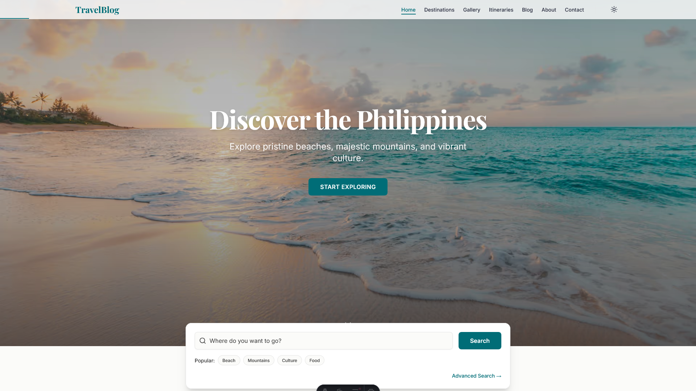

# Philippine Travel Blog Template

<div align="center">


[](https://github.com/MasuRii/travelblog-website-template/actions/workflows/deploy.yml)
[](package.json)
[](CONTRIBUTING.md)

**A high-performance, SEO-optimized travel blog template built with Astro, React, and Tailwind CSS. Specifically designed for showcasing Philippine beaches, islands, and hidden gems with an editorial magazine aesthetic.**



[Live Demo](https://masurii.github.io/travelblog-website-template/) | [Documentation](#documentation) | [Quick Start](#quick-start)

</div>

---

## Features

- **Blazing Fast** - Built with Astro's "Islands Architecture" for zero JavaScript by default
- **Interactive Destinations Map** - Full-page Leaflet map with custom category markers, clustering, and theme-aware tiles
- **Adaptive Theme System** - Seamless light and dark mode with system preference detection
- **Intelligent Search** - Fast, client-side fuzzy search powered by Fuse.js
- **PWA Ready** - Offline support via Service Workers and manifest for app-like installation
- **SEO Optimized** - Complete JSON-LD schema markup and Open Graph/Twitter cards
- **Accessibility First** - WCAG AA compliance verified with axe-core
- **Image Optimization** - Automated build-time image processing using Sharp
- **Print Friendly** - Optimized stylesheets for printing travel itineraries
- **Fully Responsive** - Mobile-first design that looks great on all devices

## Tech Stack

| Category             | Technology                                                                       |
| -------------------- | -------------------------------------------------------------------------------- |
| **Framework**        | [Astro](https://astro.build) v5.16.9                                             |
| **UI Library**       | [React](https://react.dev) v19.2.3                                               |
| **Styling**          | [Tailwind CSS](https://tailwindcss.com) v4.1.18                                  |
| **State Management** | [Nanostores](https://github.com/nanostores/nanostores)                           |
| **Maps**             | [Leaflet](https://leafletjs.com) & [React Leaflet](https://react-leaflet.js.org) |
| **Search**           | [Fuse.js](https://www.fusejs.io) v7.1.0                                          |
| **Image Processing** | [Sharp](https://sharp.pixelplumbing.com) v0.34.5                                 |
| **Testing**          | [Vitest](https://vitest.dev), [Playwright](https://playwright.dev)               |
| **Deployment**       | [GitHub Pages](https://pages.github.com) / [Vercel](https://vercel.com)          |

## Quick Start

### Prerequisites

- [Bun](https://bun.sh) (recommended) or [Node.js](https://nodejs.org) 18+
- [Git](https://git-scm.com)

### Installation

```bash
# Clone the repository
git clone https://github.com/MasuRii/travelblog-website-template.git
cd travelblog-website-template

# Install dependencies
bun install  # or npm install

# Start development server
bun dev  # or npm run dev
```

The site will be available at `http://localhost:4321`

## Commands

All commands are run from the root of the project:

| Command                     | Description                                |
| --------------------------- | ------------------------------------------ |
| `bun install`               | Install dependencies                       |
| `bun dev`                   | Start local dev server at `localhost:4321` |
| `bun build`                 | Build production site to `./dist/`         |
| `bun preview`               | Preview production build locally           |
| `bun run lint`              | Run ESLint for code quality                |
| `bun run format`            | Run Prettier for code formatting           |
| `bun run type-check`        | Run TypeScript type checking               |
| `bun run test`              | Run unit tests with Vitest                 |
| `bun run test:e2e`          | Run E2E tests with Playwright              |
| `bun run test:a11y`         | Run accessibility tests with axe-core      |
| `bun run images:fetch`      | Download placeholder images from Unsplash  |
| `bun run images:validate`   | Validate image diversity                   |
| `bun run data:validate:all` | Validate all data files                    |

## Project Structure

```
travelblog-website-template/
├── public/                    # Static assets (favicon, robots.txt, PWA icons)
├── src/
│   ├── assets/               # Images and fonts
│   │   └── images/           # Destination and placeholder images
│   ├── components/
│   │   ├── Map/              # Map components (FullPageMap, MapCluster, etc.)
│   │   ├── Skeleton/         # Loading skeleton components
│   │   ├── UI/               # UI components (Button, Input, Select)
│   │   ├── Hero.astro        # Landing hero section
│   │   ├── Navigation.tsx    # Header navigation
│   │   ├── Footer.tsx        # Site footer
│   │   ├── QuickSearch.tsx   # Fuzzy search component
│   │   ├── PhotoGallery.tsx  # Image gallery with lightbox
│   │   └── ...               # Other components
│   ├── config/               # Configuration files
│   ├── constants/            # Category definitions
│   ├── data/                 # Destination data files
│   ├── hooks/                # Custom React hooks
│   ├── i18n/                 # Internationalization files
│   ├── layouts/              # Page layouts
│   │   └── BaseLayout.astro  # Main layout with SEO
│   ├── pages/                # Astro pages
│   │   ├── index.astro       # Home page
│   │   ├── map.astro         # Full-page map
│   │   ├── destinations/     # Destination listing and detail pages
│   │   ├── blog/             # Blog listing and post pages
│   │   └── ...               # Other pages
│   ├── store/                # Nanostores state management
│   ├── styles/               # Global CSS
│   ├── types/                # TypeScript type definitions
│   └── utils/                # Utility functions
├── tests/                    # E2E and unit tests
├── scripts/                  # Build and utility scripts
├── .github/workflows/        # GitHub Actions CI/CD
└── package.json
```

## Customization

### Content

Destination data is managed as structured TypeScript files in `src/data/destinations/`. Adding a new destination is as simple as creating a new file and exporting the data object.

### Images

The project includes automated scripts for managing images:

1. Fetch placeholder images: `bun run images:fetch`
2. Validate image diversity: `bun run images:validate`
3. Verify processing: `bun run images:verify`

### Styling

The project uses Tailwind CSS with a custom design system. Key customization points:

- Colors and theme variables in `src/styles/global.css`
- Typography using Playfair Display and Inter fonts
- Component-specific styles in their respective `.astro` and `.tsx` files

## Deployment

This project supports both **GitHub Pages** and **Vercel** deployment:

### GitHub Pages (Automatic)

1. Push your code to GitHub
2. Enable GitHub Pages in repository settings (Settings → Pages → Source: GitHub Actions)
3. The included workflow will automatically build and deploy on every push to `main`
4. Your site will be available at `https://<username>.github.io/<repo-name>/`

### Vercel

1. Push your code to GitHub
2. Import the repository in [Vercel](https://vercel.com)
3. Deploy!

### Other Platforms

For other platforms, run `bun build` and deploy the `dist/` folder.

## Documentation

For detailed information on customizing your travel blog, refer to the [Customization](#customization) section above.

## Contributing

Contributions are welcome! Please read our contributing guidelines before submitting a pull request.

We follow:

- [Conventional Commits](https://www.conventionalcommits.org/) for commit messages
- ESLint and Prettier for code style

---

<div align="center">

**Built with love by [MasuRii](https://github.com/MasuRii)**

If you found this helpful, please consider giving it a star!

[](https://github.com/MasuRii/travelblog-website-template)

</div>
